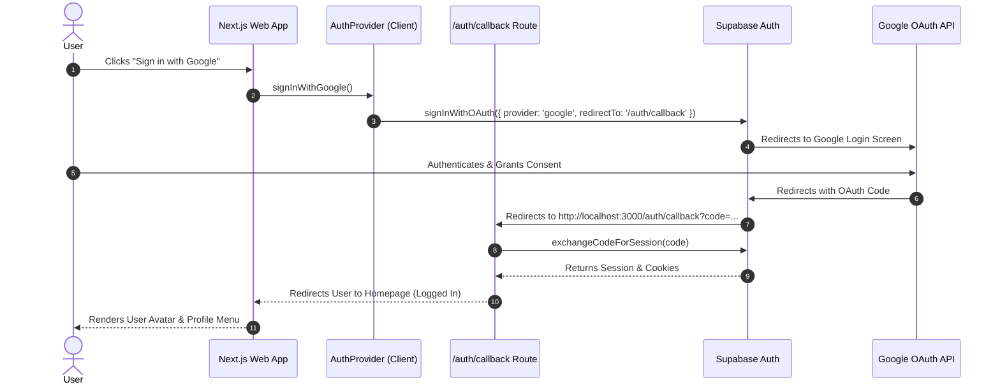

# Vidya Pod — Supabase Google OAuth Setup Guide

This guide provides step-by-step instructions to configure **Google OAuth Authentication** for the Vidya Pod project using **Supabase** and **Google Cloud Console**.

---

## Table of Contents
1. [Prerequisites](#1-prerequisites)
2. [Step 1: Google Cloud Console Configuration](#step-1-google-cloud-console-configuration)
3. [Step 2: Supabase Dashboard Configuration](#step-2-supabase-dashboard-configuration)
4. [Step 3: Local Environment Variables (`.env.local`)](#step-3-local-environment-variables-envlocal)
5. [Step 4: Database Schema Setup](#step-4-database-schema-setup)
6. [Step 5: How It Works (Architecture Overview)](#step-5-how-it-works-architecture-overview)
7. [Troubleshooting & Common Errors](#troubleshooting--common-errors)

---

## 1. Prerequisites
- A **Supabase Project** (e.g., `your-project-ref.supabase.co`)
- A **Google Account** to access Google Cloud Console
- Node.js (v18+) installed locally

---

## Step 1: Google Cloud Console Configuration

### 1.1 Create a Google Cloud Project
1. Go to the [Google Cloud Console](https://console.cloud.google.com/).
2. In the top navigation bar, click the project dropdown and select **New Project**.
3. Name your project **Vidya Pod** and click **Create**.

### 1.2 Configure OAuth Consent Screen
1. In the left sidebar, navigate to **APIs & Services** → **OAuth consent screen**.
2. Select **External** user type and click **Create**.
3. Fill in the App Information:
   - **App Name**: `Vidya Pod`
   - **User Support Email**: Your email address
   - **Developer Contact Information**: Your email address
4. Click **Save and Continue** through Scopes and Test Users.

### 1.3 Create OAuth 2.0 Credentials
1. Navigate to **APIs & Services** → **Credentials**.
2. Click **+ Create Credentials** → **OAuth client ID**.
3. Select **Web application** as Application Type.
4. Set **Name**: `Vidya Pod Web App`
5. Under **Authorized redirect URIs**, click **+ Add URI** and enter:
   ```text
   https://<YOUR-SUPABASE-PROJECT-REF>.supabase.co/auth/v1/callback
   ```
   *(For example: `https://your-project-ref.supabase.co/auth/v1/callback`)*
6. Click **Create**.
7. Copy the generated **Client ID** and **Client Secret**.

---

## Step 2: Supabase Dashboard Configuration

### 2.1 Enable Google Provider
1. Log in to the [Supabase Dashboard](https://supabase.com/dashboard).
2. Select your project (**your-project-ref**).
3. In the left sidebar, click **Authentication** 🔑 → **Providers**.
4. Scroll down to **Google** and toggle it **ON**.
5. Paste your credentials:
   - **Client ID**: Paste from Google Cloud Console
   - **Client Secret**: Paste from Google Cloud Console
6. Click **Save**.

### 2.2 Configure Redirect URLs
1. In the Supabase Dashboard, go to **Authentication** 🔑 → **URL Configuration**.
2. Set **Site URL**:
   ```text
   http://localhost:3000
   ```
3. Under **Redirect URLs**, click **Add URL** and add:
   ```text
   http://localhost:3000/auth/callback
   ```
   *(For production, add `https://your-domain.com/auth/callback` as well).*
4. Click **Save**.

---

## Step 3: Local Environment Variables (`.env.local`)

In your project root (`c:\Users\trvag\Desktop\opensource\vidya-pod`), open or create [.env.local](file:///c:/Users/trvag/Desktop/opensource/vidya-pod/.env.local) and populate it:

```env
# Supabase Configuration
# IMPORTANT: Base URL ONLY (Do NOT include /rest/v1 at the end)
NEXT_PUBLIC_SUPABASE_URL=https://your-project-ref.supabase.co
NEXT_PUBLIC_SUPABASE_ANON_KEY=your-supabase-publishable-or-anon-key

# Cashfree Payment Gateway (server-only)
CASHFREE_CLIENT_ID=your-client-id
CASHFREE_SECRET_KEY=your-secret-key
CASHFREE_BASE_URL=https://sandbox.cashfree.com

# Application URL
NEXT_PUBLIC_APP_URL=http://localhost:3000
```

> **Where to find `NEXT_PUBLIC_SUPABASE_URL` and `NEXT_PUBLIC_SUPABASE_ANON_KEY`:**
> - In Supabase Dashboard → **Integrations** → **Data API** (URL: `https://<ref>.supabase.co`).
> - In Supabase Dashboard → **Settings** → **API Keys** (Publishable key: `sb_publishable_...` or `anon` key).

---

## Step 4: Database Schema Setup

To ensure all tables required by Vidya Pod exist:

1. In Supabase Dashboard, click **SQL Editor** in the left sidebar.
2. Click **+ New Query**.
3. Open [supabase-schema.sql](file:///c:/Users/trvag/Desktop/opensource/vidya-pod/supabase-schema.sql), copy its content, paste it into the editor, and click **Run**.

---

## Step 5: How It Works (Architecture Overview)



---

## Troubleshooting & Common Errors

| Error Message | Cause | Solution |
| :--- | :--- | :--- |
| **`Unsupported provider: provider is not enabled`** | Google provider is toggled OFF in Supabase. | Go to Supabase Dashboard → **Authentication** → **Providers** → **Google** → Toggle **ON** and save Client ID/Secret. |
| **`No API key found in request`** | `NEXT_PUBLIC_SUPABASE_URL` has `/rest/v1/` appended at the end. | Remove `/rest/v1/` from `.env.local` so it is just `https://<ref>.supabase.co`. |
| **`redirect_uri_mismatch`** | Redirect URI in Google Cloud doesn't match Supabase callback. | Check Google Cloud Console → Credentials → OAuth Client ID → Authorized redirect URIs must be `https://<ref>.supabase.co/auth/v1/callback`. |
| **`prerender-manifest.json missing` / Build errors** | Cache conflict when `npm run build` ran alongside `npm run dev`. | Stop `npm run dev`, delete `.next` folder (`Remove-Item -Recurse -Force .next`), and restart `npm run dev`. |

---

## Testing Your Setup

1. Clear Next.js cache and start the server:
   ```powershell
   Remove-Item -Recurse -Force .next
   npm run dev
   ```
2. Open `http://localhost:3000`.
3. Click **Sign in with Google** in the top navigation header.
4. Select your Google Account.
5. Upon successful authentication, you will be redirected back to the site showing your avatar and full name!
